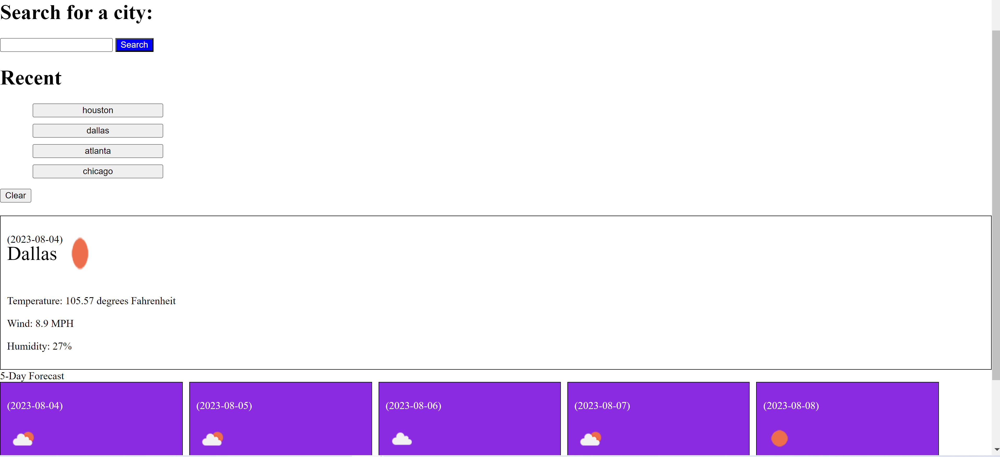

# Weather Dashboard Application

## Description

Weather Application that uses 3rd Party API Openweather to
get real-time data for whatever city the user inputs into 
the search bar. Data includes temperature, wind speed, humidity, date, name and an icon that represents the weather. Uses localStorage to keep the data from previous searches persistent on the web app and includes a clear button to clear the local storage also.

## Screenshot

## Link
